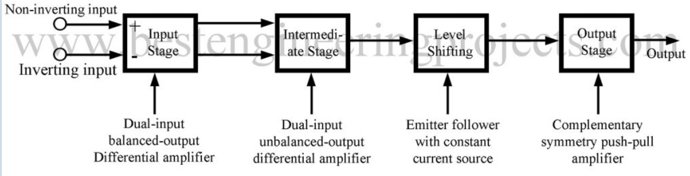
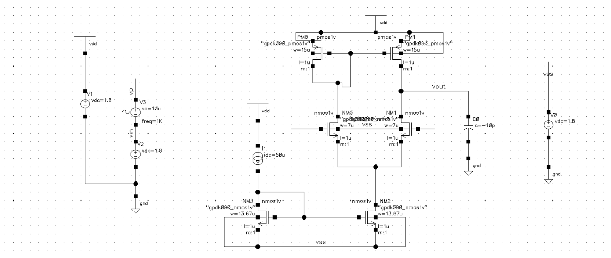
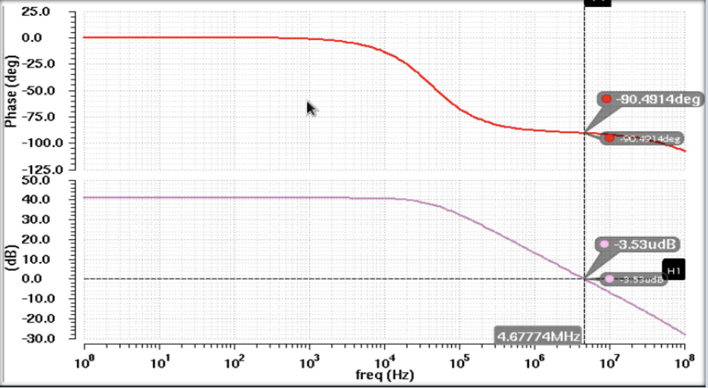
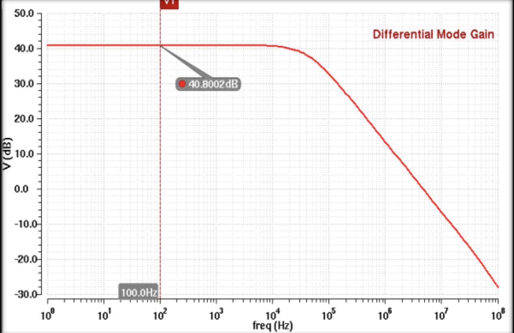
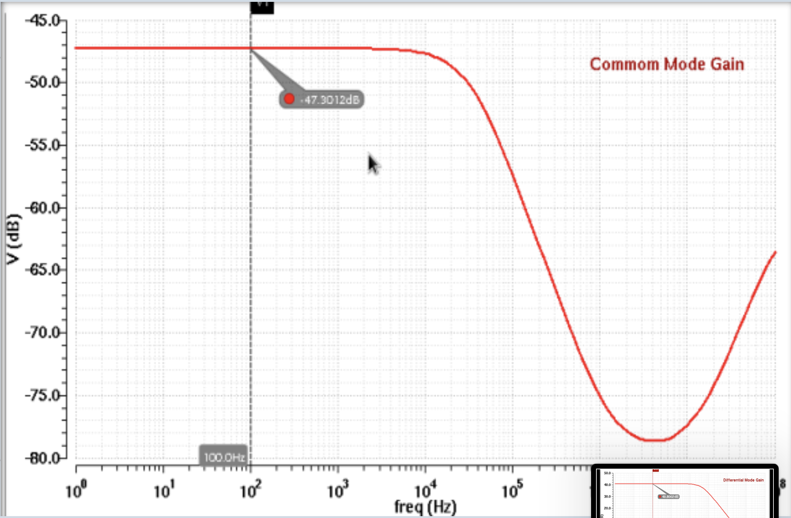
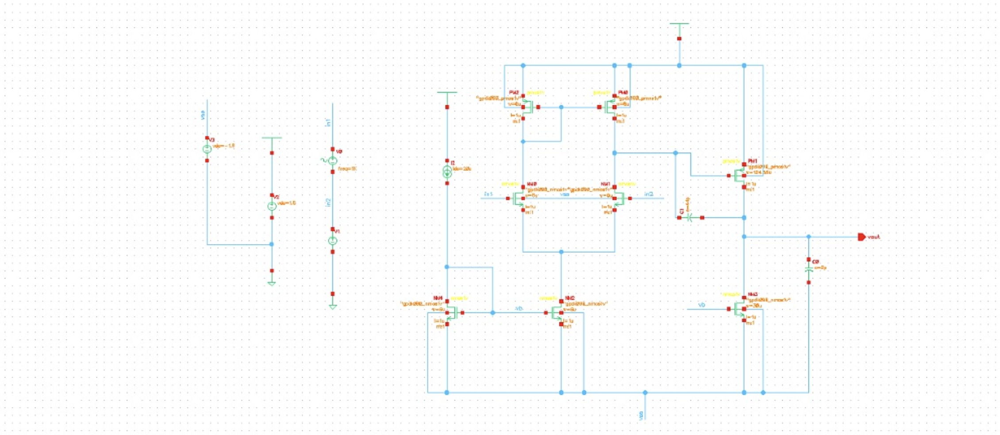
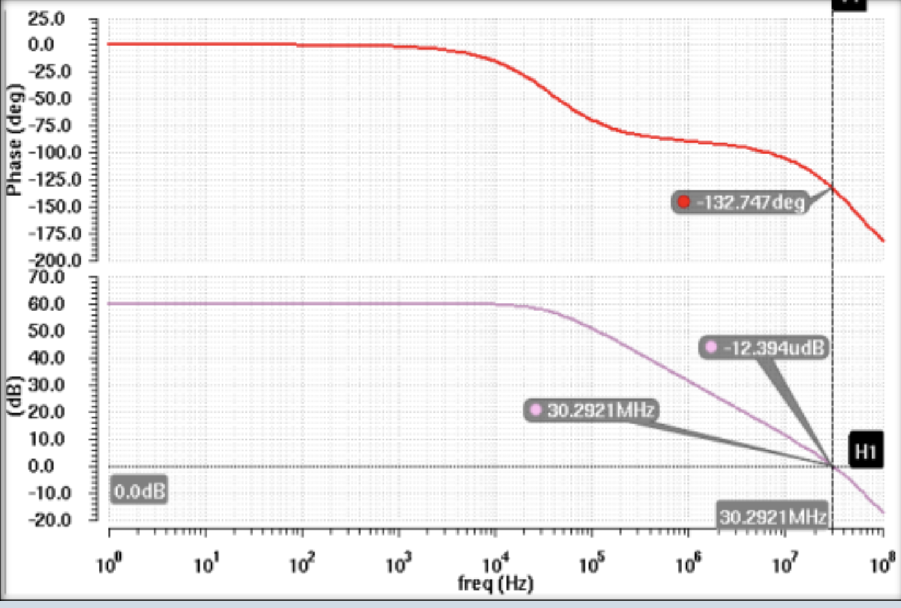
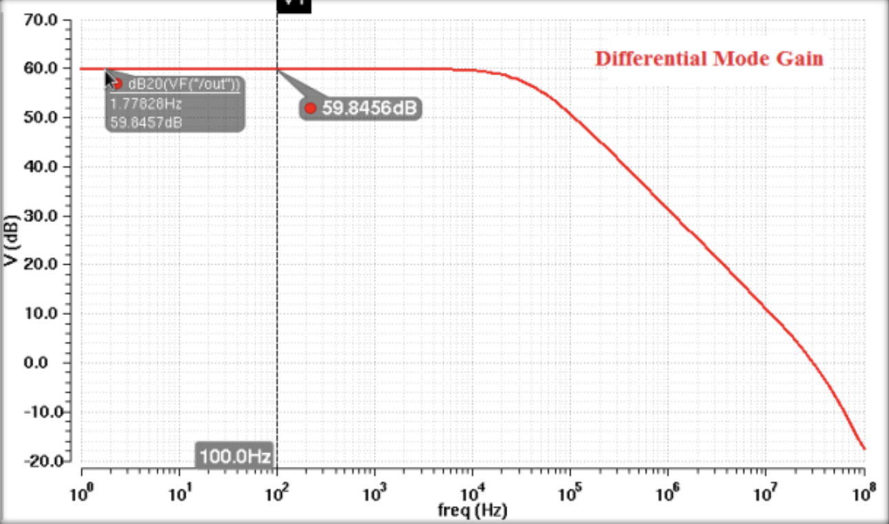
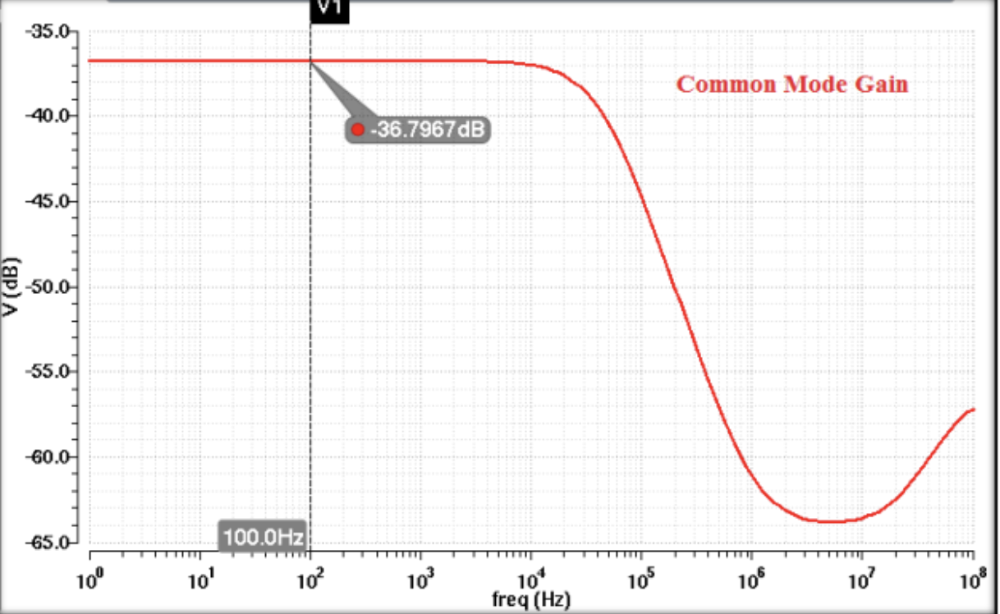

# Design and Verification of 1-Stage and 2-Stage Operational Amplifiers

An analog IC design project comparing a Single-Stage Op-Amp and a Two-Stage Miller-Compensated Op-Amp using the **gpdk180 (180nm) technology node**.

## 🏫 Institutional Affiliation
* **College:** PSG College of Technology, Coimbatore

## 👥 Project Team
* **Mithun Hari** (22L232)
* **Raghavan** (22L255)
* **Vijhay Valliappan** (22L280)
* **Thughilan** (22L284)

---

## 📌 Project Overview
This project focuses on the comparative analysis, transistor sizing, and simulation verification of a Single-Stage Operational Amplifier and a Two-Stage Miller-Compensated Operational Amplifier. Both topologies were designed to meet target specifications using manual sizing workflows and validated inside Cadence Virtuoso using the Spectre simulation platform.

### 🏗️ Op-Amp Architectural Block Diagram
A typical internal multi-stage structure of an operational amplifier consists of an input differential stage, intermediate gain stage, level shifter, and an output buffer stage.

  

---
## 📊 Comparative Performance Matrix

| Performance Parameter | 1-Stage Op-Amp | 2-Stage Op-Amp | Analysis & Insights |
|:---|:---:|:---:|:---|
| **DC Differential Gain (Ad)** | 40.80 dB | 59.85 dB | The 2-stage achieves nearly 20 dB higher gain due to cascaded amplification. |
| **Common Mode Gain (Ac)** | -47.30 dB | -36.80 dB | The 1-stage exhibits better raw common-mode signal suppression. |
| **CMRR** | 88.10 dB | 96.64 dB | The 2-stage achieves superior CMRR due to its massive differential gain advantage. |
| **Gain Bandwidth (GBW)** | 4.68 MHz | 30.29 MHz | The 2-stage offers an expanded frequency response range. |
| **Phase Margin (PM)** | ≈89.5° | 47.25° | The 1-stage is unconditionally stable; the 2-stage trades PM for bandwidth. |
| **Slew Rate (SR)** | 5.32 V/µs | 42.50 V/µs | The 2-stage handles fast large-signal transient changes significantly faster. |

---

## 🛠️ Circuit 1: Single-Stage Op-Amp Design

The single-stage architecture implements a dual-input balanced-output differential amplifier paired with active load current mirrors to maximize common-mode rejection and initial gain.

### 📐 Final Sizing Parameters
* **Differential Input Pair ($M1, M2$):** $W/L = 7$
* **Active Load Mirrors ($M3, M4$):** $W/L = 15$
* **Tail Current Mirrors ($M5, M6$):** $W/L = 13.67$

### 🖥️ Schematic Capture

  

### 📈 AC Characterization Waveforms
**Phase Gain**

  

**1. Differential Gain**
**2. Common Gain**

  
  

---

## 🛠️ Circuit 2: Two-Stage Op-Amp Design

The two-stage configuration splits voltage amplification into an initial input differential stage followed by a common-source output stage. **Miller Compensation ($C_c$)** and **Pole-Splitting** techniques are used to isolate dominant and non-dominant poles to maintain feedback loop stability.

### 📐 Final Sizing Parameters
* **Transistor Ratios:** $M1, M2 = 6$ | $M3, M4 = 8$ | $M5 = 124.56$ | $M6 = 31.14$ | $M7, M8 = 4$

### 🖥️ Schematic Capture

  

### 📈 AC Characterization Waveforms

  

  
  

---

## 💡 Key Engineering Takeaways
1. **The Gain-Stability Dilemma:** The single-stage topology functions effectively as a single-pole system, yielding near-perfect stability ($PM \approx 89.5^\circ$) but bounding your open-loop gain to $40.8\text{ dB}$. Reconfiguring into a 2-stage architecture successfully boosts the open-loop gain to $59.85\text{ dB}$ and scales the bandwidth to $30.29\text{ MHz}$, while maintaining stability above design constraints ($PM = 47.25^\circ$).
2. **Transient Optimization:** By utilizing targeted compensation networks, the 2-stage design achieves an **8x transient speed acceleration in Slew Rate** ($42.50\text{ V/}\mu\text{s}$) over the initial single-stage benchmark ($5.32\text{ V/}\mu\text{s}$).

## ⚙️ CAD Software Used
* **Cadence Virtuoso** (Schematic Capture)
* **Spectre Simulation Platform** (AC, Transient, & Common Mode Analysis)

---
> 📝 **Note on Project Status:** Due to a routine server reset on the college lab workstations, the live Cadence schematic databases and simulation netlist directories were flushed. This repository serves as the definitive structural and graphical backup of the analytical models, project slides (`final.pptx`), and simulated hardware performance verification graphs generated during the design cycle.
